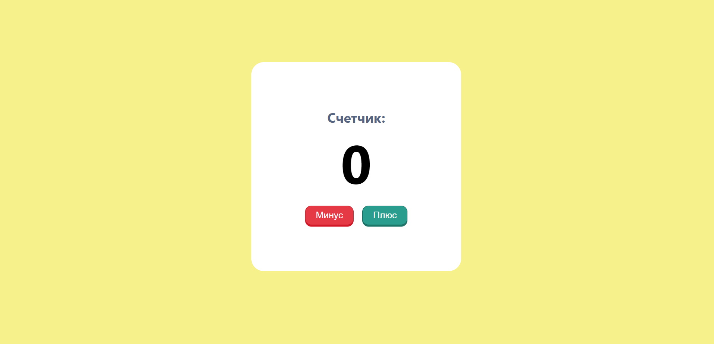

# Counter-App (HTML / SASS / JS / REACT)

## Обзор 🌟
Простое приложение-счетчик с современным дизайном, позволяющее увеличивать и уменьшать значение счетчика с помощью интуитивно понятных кнопок.

### [Посмотреть демо 👈](https://subbotinroman.github.io/CounterApp-React.JS/) 



---

## Стек технологий ⚙️


---

## Возможности 🚀

- Увеличение счетчика при нажатии кнопки “плюс” ➕
- Уменьшение счетчика при нажатии кнопки “минус” ➖

---

## Как запустить локально 💻

1. Клонируйте репозиторий:
```bash
git clone https://github.com/SubbotinRoman/CounterApp-React.JS.git
```

2. Перейдите в папку с проектом:
```bash
cd CounterApp-React.JS
```

3. Установить зависимости через npm:
```bash
npm install
```
или через yarn:
```bash
yarn
```

4. Запустите проект через npm:
```bash
npm run dev
```
или через yarn:
```bash
yarn dev
```
